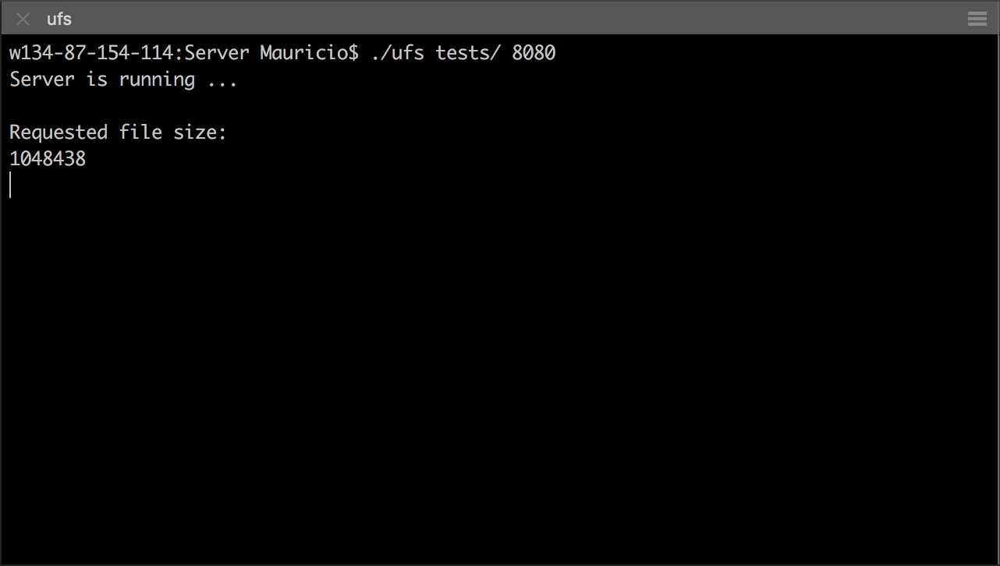
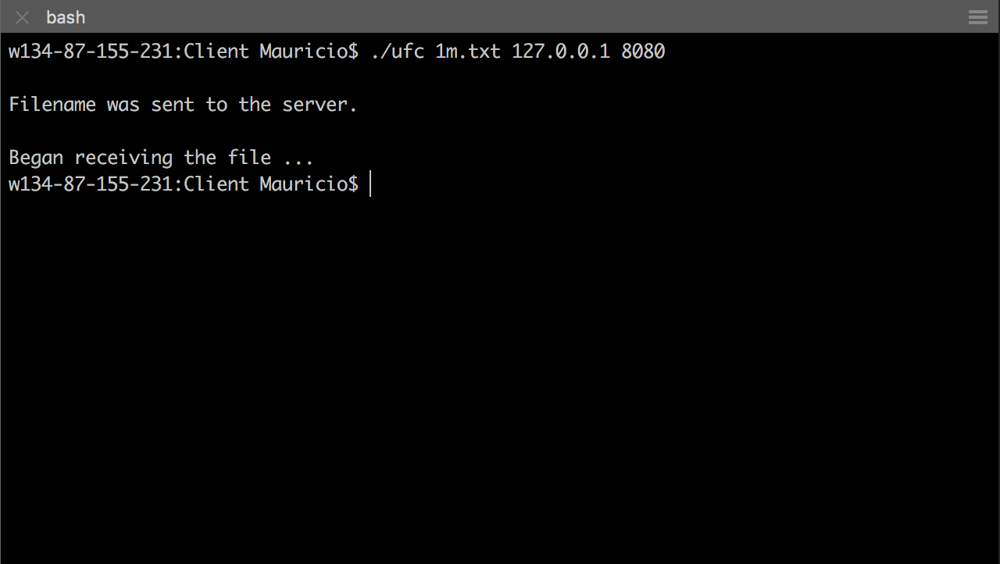
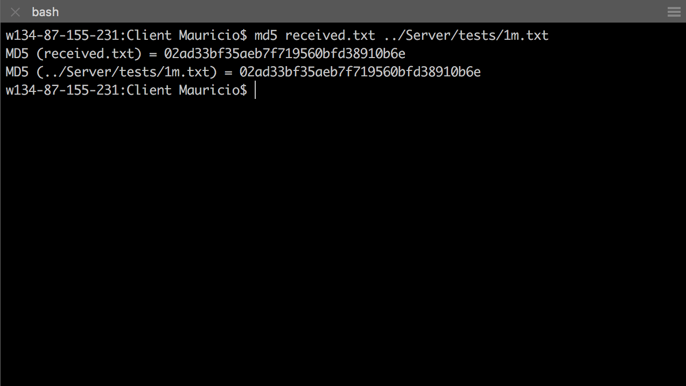

# UDP File Transfer

A server side application that listens for requests from clients and transfers requested files via the UDP protocol. A client side application that sends a request for a file to a server and receives the file.

## Getting Started
Sample text files are provided in the ```tests``` folder in the server application.
Start by compiling the files.

### On the Server Machine
```
gcc ufs.c -o ufs
```
### On the Client Machine
```
gcc ufc.c -o ufc
```

## Running the Applications
### Server
To run the server side application:
```
./ufs tests/ 8080
```

change ```tests/``` and ```8080``` to be your directory and port number of choice.

### Client
To run the client side application:
```
./ufc 1m.txt 127.0.0.1 8080
```

change ```127.0.0.1``` and ```8080``` to match the server's IP address and port number. Change ```1m.txt``` to match the file wanted to transfer from the server.

## Result
Comparing the results show that the file received on the client side is the same as the file stored on the server side.

